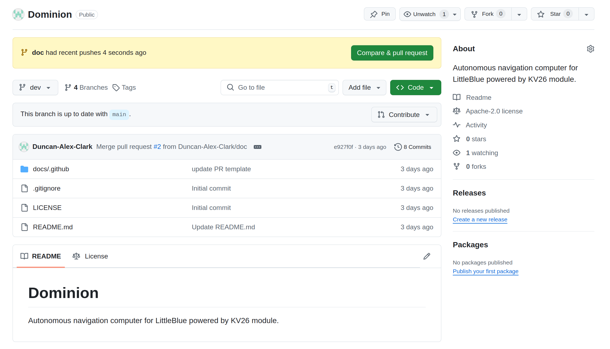

# How to Contribute to Dominion

Thank you for your interest in contributing to the Dominion project. 

In this document, you will learn how the project is organized, how to contribute to the 

## How to Start Contributing

Here are the main points to consider when seeking to contribute:

* Understand the branch structure described below.
* If you have a ticket, you should create a branch to work on that ticket.
* If you are contributing by some other means (i.e features, bugs, or hotfixes), they should get their own branch.
* If you are working within the FPGA User Group, you should almost certainly make a ticket so the team can see what you are working on.
* You are the only person who can approve changes to your branch. It belongs to you!
* In almost every case, your new branch will originate from dev, NOT main.
* When you have completed your ticket, bug fix, etc., create a pull request (PR) to pull your changes into the dev branch.
* Remember to pull any changes from dev into your branch and test before submitting a PR.
* In the description of your PR, place the pull_request_template and fill out the various fields.
* Any maintainer can approve PRs to the dev branch. You cannot approve your own PR.
* Only the repository administrator can approve PRs to main.

## Branch Structure

Understanding the branch structure of the Dominion project is essential to making meaningful contributions. In general, main is considered the most stable branch. As main is branched from, every layer deeper is considered a less stable and untested branch. If you are designing a complex feature requiring multiple contributors, it's possible that the feature branch will have multiple branches for each ticket, bug, or contributor writing code for the feature. In this case, the owner of the feature has the authority on what PRs to approve or not.

Below describes the various branch types, how they are structured, and when you would create them.

REMEMBER: After creating a new branch, the first command you enter should be ```git push -u origin <branch name>```. This will push the newly created branch to the remote repository so other can see what you are working on. It has the added function of allowing you to push to the remote repo without any special flags.

### main

main is considered the most stable release. In most cases, the only time you are interacting with this branch is when you want to inspect the code from the latest release. In some cases where a critical bug has been found, a "hotfix" branch can be created from main. This is meant to bypass any ongoing development work not ready for main (more on that later). 

Another example of when you might interact with main is by fetching its contents in the event that you'd like to test if your code works with the latest release. If you would like to do this, you would execute a "git fetch origin main" command to bring the contents from main into your project without actually pulling the contents into your branch. This would be a rare occurance as all code from the latest release should be included in the dev branch. 

In most cases, main is simply a place to store stable code and is not a place to be working from.

#### hotfixes

These are a rare exception where a branch is created with main serving as the head. Hotfix branches are intended to solve critical bugs that require immediate release and cannot wait for the current development cycle to complete.

The format of a hotfix branch is as follows:

```hotfix/<name of hotfix>```

The name of the hotfix should be short, clear, and in camelCase. An example hotfix branch name is as follows:

```hotfix/qcsLatency```

To create a hotfix branch, enter the following command:

```git checkout -b hotfix/<name of hotfix> main```

This command will checkout a new hotfix branch with the main branch serving as the head.

### dev

The dev branch is the main working development branch. You will interact with this branch often.

Here is a list of possible scenarios and the git command to start developing as a starting point:

* You have a ticket to implement a new feature (ticket #22): ```git checkout -b t<ticket number>/<name of ticket> dev```
* You have found a bug in the code that is non-critical: ```git checkout -b bug_<name of bug> dev```

As mentioned earlier, if you are a member of the FPGA User Group, you should always make a ticket so the team knows what you are working on.

#### ticket

A ticket branch will be the most common type of branch you work on. The format of a ticket branch name is the following:

```t<ticket number>/<name of ticket>```

The 't' signifies that there is a ticket associated with this branch. You can find the ticket number on Trello.

The name of the ticket should be short, clear, and written in camelCase. It does not have to perfectly match the title of the ticket on Trello.

Example branch names would be as follows:

```t27/qcs```
```t32/dcMotorController```

To create a ticket branch, execute the following command:

```git checkout -b t<ticket number>/<name of ticket> dev```

This command will checkout your new branch with the dev branch serving as the head. 

#### feature

Feature branches are more applicable to contributors from outside the FPGA user group. For anyone who wants to contribute a feature but does not have access to the Trello board, this is the branch type you would use.

Feature branches have the following format:

```feature/<name of feature>```

Leading with 'feature' indicates that this is a feature branch. 

The name of the feature should be short, clear, and written in camelCase. An example would be:

```feature/dualIMU```

To create this feature branch, you can type the following command:

```git checkout -b feature/<name of feature> dev```

This will checkout your new branch with the dev branch serving as head. 

#### bug

Bug branches are dedicated to solving problems with existing features. These branches should originate from dev. 

Bug branches have the following format:

```bug/<name of bug>```

The name of the bug should be short, clear, and written in camelCase. An example would be:

```bug/i2cTiming```

Notice how the name is not "i2cTimingIssue" or "i2cTimingBug". This is implied by the nature of the bug branch.

To create a bug branch, enter the following command:

```git checkout -b bug/i2cTiming dev```

This command will checkout your new branch with the dev branch serving as the head.


#### doc

Doc branches are dedicated to creating and revising documentation that can be found in the project. They have the following format:

```doc/<name of document>```

The name of the document should be short, clear, and written in camelCase. The name should also include some unique identifier to help indicate what the document is associated with.

Example doc branch names would include:

```doc/readmeQCS```
```doc/nnTraining```

To create a document branch, enter the following command:

```git checkout -b doc/<name of document> dev```

This command will chekcout your new branch with the dev branch serving as the head.

#### refactor

Refactor branches are dedicated to altering and organizing a features code without changing the function. This might occur to increase readability, efficiency, speed of execution, translate to a new language, but will never include changing the original function of the code.

These branches have the following format:

```refactor/<name of refactor>```

The name of the refactor should be short, clear, and written in camelCase. The name should help explain what feature or part of the code base you are refactoring. 

An example refactor branch includes:

```refactor/motorControlROSNode```

You might use the above name if you wanted to refactor the code from python to C++. To create a refactor branch, enter the following command:

```git checkout -b refactor/<name of refactor> dev```

This command will checkout your new branch with teh dev branch serving as the head.

## Pull Requests

Once you have finished writing the code for your ticket, feature, bug, etc., you will want to pull those changes into the dev branch. In most cases, only code in the dev branch is ever merged with main. If you want your code to be included in a stable release, you will first have to generate a pull request into dev.

This is done throught the GitHub website. Navigate to your branch and at the top of the screen, you should see banner asking if you would like to generate a pull request. select the button.



After selecting the generate pull request button, you will be take to the PR screen. Check to make sure the PR has not automatically assumed you would like to pull this code into main. If it says main, switch the option to dev. Code contributors can only generate PRs for the dev branch. Only on rare occasions are PRs into main accepted.


Once you have selected the correct branch as base, you can continue to write a description of the PR. As a requirement for accepting a PR, you must write a description that conforms to the PR template which can be found [here](pull_request_template.md).


If all the items have been documented and the checklist items have been completed, you can submit your PR. 


